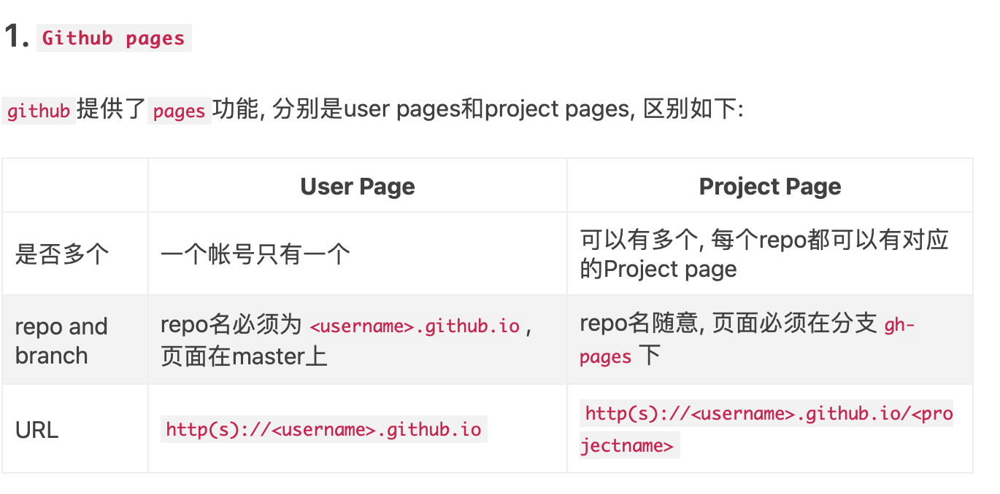

# goldlakes.github.io
My pages
introduce my pages
GitHub虽然不是一个传统的博客托管站点，但已成为程序员写博客的最爱，下面介绍几种在github上写博客的方法.

1. Github pages

github提供了pages功能, 分别是user pages和project pages, 区别如下:

User Page	Project Page
是否多个	一个帐号只有一个	可以有多个, 每个repo都可以有对应的Project page
repo and branch	repo名必须为<username>.github.io, 页面在master上	repo名随意, 页面必须在分支gh-pages下
URL	http(s)://<username>.github.io	http(s)://<username>.github.io/<projectname>
举例 - w3c:

W3C是一个使用github pages的一个很好的例子, w3c是github帐号名, 在user pages上定义了如何定义w3c spec, 即在repo "w3c.github.io" (对应的repo地址为 https://github.com/w3c/w3c.github.io ), 我们可以使用URL http://w3c.github.io 访问对应页面, 每一个spec都对应了一个project repo, 譬如webrtc, 文档定义在repo "webrtc-pc"的分支"gh-pages"下面, 对应的URL为 http://w3c.github.io/webrtc-pc

优点:

可以使用任意模版
是最正统的在github上写博客的方法
缺点:

需要自己定义模版 (也可以找别人现成的模版)
不能在线写博客, 需要在本地编写博客文件, 然后使用git命令提交到github
需要理解github pages, 需要懂git命令, 有一些门槛
总结:

这个方式适合对博客模版有要求, 了解git和github pages的人
因为有一点门槛, 适合爱折腾的程序员, 不适合普通人
2. 直接提交静态文件到github pages (Hexo等)

Github Pages其实等于jekyll engine + static web server, 方法1其实是利用jekyll搭建blog, 这两个功能都用到了.

我们也可以不使用jekyll engine, 只利用static web server这个功能, 也就是说, 直接上传静态站点文件html/css/javascript/image等等, 让Github Pages帮我们host这些静态页面.

Hexo + Github pages搭建blog其实就是只利用了github pages的static web server功能, hexo基于node.js, hexo在本机将用户的blog翻译成静态页面, 然后将这些静态页面上传到github上, 由github pages的static web server部署这些静态页面.

hexo与jekyll的主要区别是:

md到html的转换时机不同, hexo在本机完成, jekyll是由github pages完成
提交到github库里的文件不同, hexo是提交转换后的静态页面, jekyll是提交转换前的md文件
我们可以使用hexo在本机写博客, 然后上传静态文件到github, 我们也可以使用其他模版引擎在本机写博客, 其实方法1里, 我们如果利用本机jekyll编译出静态文件, 然后只提交这些静态文件, 这样的做法和Hexo是一样的, 或者, 你也可以使用任何一种模版引擎 ( https://github.com/coffee-js/languages/wiki/static-blog-tools )来生成静态博客站点, 当然, 你也可以直接写html.

优点:

可以使用任意模版技术, 方法1其实是jekyll模版技术
可以使用任意模版
仍然是正统的在github上写博客的方法
缺点:

需要找到适合自己的模版技术, hexo是比较流行的一种
需要自己定义模版 (也可以找别人现成的模版)
需要在本地编写博客文件, 然后使用git命令提交到github
需要理解github pages, 需要懂git命令, 需要懂模版技术, 有一些门槛
总结:

这个方式适合对博客模版有要求, 了解模版技术, 了解git和github pages的人
有一点门槛, 适合爱折腾的程序员, 不适合普通人
3. 利用github issue写博客

利用github issues写博客也是一种做法. 我的博客: https://github.com/rainzhaojy/blogs/issues

优点:

简单方便
可以在线写, 可以预览, 可以评论, 可以加tag
缺点:

无法定制模版
总结:

如果你对github issues的格式能够接受, 那么这是最适合的方式
基本没有门槛, 适合绝大多数人, 推荐
4. 利用github wiki写博客

github wiki当然也可以写博客, github上每一个projec都有一个对应的wiki, 你可以在这里写博客, 譬如 https://github.com/coffee-js/languages/wiki

优点:

就是一个wiki系统，可以灵活的创建wiki page并相互link，也可以自定义右边的sidebar
缺点:

相比github issues，没有comments功能
5. 直接在repo里提交markdown文件

github建议每个项目都提供一个README.md文件, 在网页上浏览项目或子目录时, github会自动显示当前目录里的README.md文件, 利用这一功能, 也有人直接提交markdown文件, 譬如 https://github.com/kilimchoi/engineering-blogs, 这样也是一种方法, 只是打开你的blog时上面会先看到file list.

这样的做法其实就是把博客的md文件当成源代码一样提交到github里.

优点:

相比前面几种, 好像没什么独有的优点
缺点:

会看到文件列表, 格式比issues/wiki难看
需要懂git命令, 有一些门槛
总结:

既没有方法1, 2能够定制模版这样的优点, 又没有方法3, 4里可以在线编辑的优点, 因此不推荐这个方法
6. 项目文档的好选择

最近在为公司项目文档选型的时候发现一个不错的项目https://docusaurus.io/, 这是Facebook的开源项目，基于Nodejs，使用markdown，非常适合用于写项目文档，也可用于个人知识整理，相当于是wiki+blog系统，非常方便，样式也不错，和GA、搜索等也都集成的不错，也可以和GitHub Pages集成。拍乐云的项目文档就使用了这个，参考这里：https://developer.pano.video, Enjoy！
